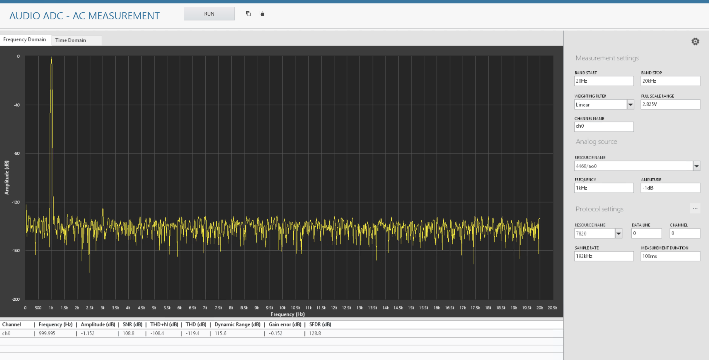

# Audio ADC - LabVIEW

## Overview

"audio-adc-labview" is a MeasurementLink LabVIEW plugin for making measurements for Audio ADC's.

This plugin generates analog signal and measures the digital audio output of the ADC

## Key Features

 - Generates analog signal supporting below protocols
   - I2S
   - Left Justified
   - Right Justified
   - TDM
 
 - Single tone measurements
   - THD
   - THD+N
   - SNR
   - SFDR
   - Dynamic range
   - Gain error

## Software Dependencies

Install from NI Package Manager:

- NI-DCPower (As recommended by InstrumentStudio, if SMUs are used for powering up the DUT)
- InstrumentStudio (2024 Q1 or higher)
- Measurement Link (2024 Q1 or higher)

Download the latest NI package from the releases section of this repo or add the feed to NI Package Manager to get updates from this repo and other in this community

## Getting Started
When you are ready to start using the software, check out [this](docs/help.md).

## Contributing
Use the instructions in [software development](docs/software-development.md) for setting up a development environment and overview of the code.

