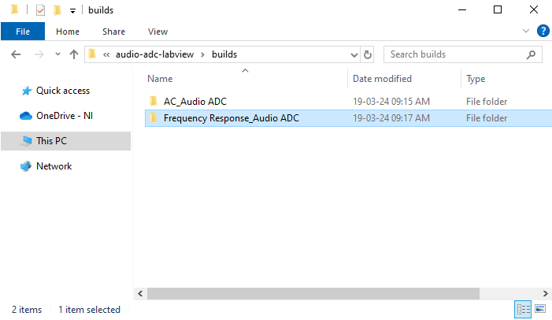
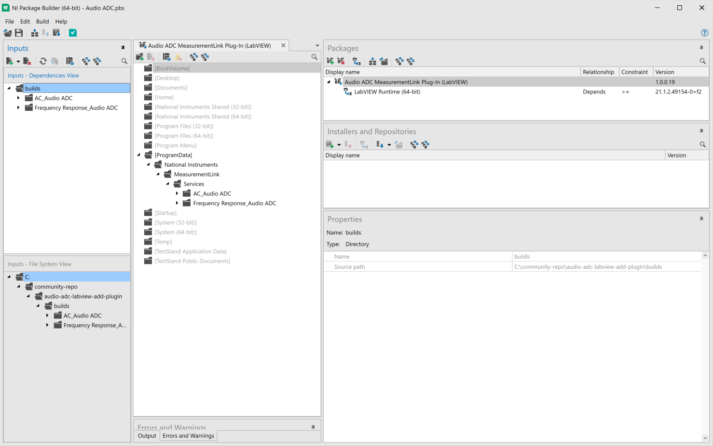
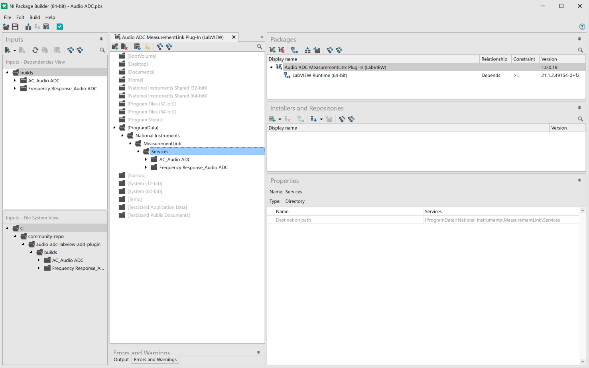
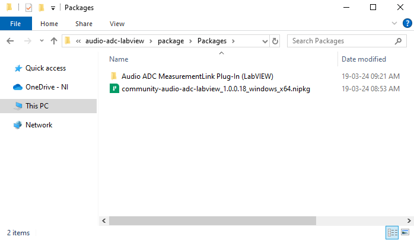

## Build EXE for each measurement
1. Open the measurement lvproj for which you would like to build EXE, and select 'Build Specifications'.
    
    

2. Right click the build spec for UI packed library and click 'Build.

    

3. Once the build is complete, 'BuiltUI' folder can be seen under the measurement folder.

    

    The UI packed library must be present under the 'BuiltUI' folder.

    

4. Right click the build spec for Measurement EXE and click 'Build'.
    
    

5. Once the build is complete, you should be able to see measurement EXE folder under '/builds' folder.
    
    

6. Under the measurement folder, you should able to see the EXE files with BuiltUI folder.
    
    

7. Similarly, build EXEs for all the measurements.
    
    

Note: Please note that the /builds folder must not be committed to repo and will be ignored by .gitignore upon commit.

## Build NIPKG for the plugin

1. Open the NIPM package build spec under /packages folder
    
    

2. Select the Package listed under 'Packages' tab. Ensure the version and other configurations are updated under 'Properties' tab.
    
    

3. For LabVIEW packages, ensure LabVIEW Run Time Engine is added as a dependency. If not, add it by right clicking on package name and selecting 'Add Dependencies'.
    
    

4. In the Inputs tab, ensure the 'builds' folder is loaded with all measurement EXEs. 

    

5. Ensure the destination for the package installation is set to the below location:
    "C:\ProgramData\National Instruments\MeasurementLink\Services"

    

6. Click on 'Build Solution' icon.

    

7. Once the build process is complete, you should be able to see a new version of package created in Packages folder parallel to build spec.
    
    **Packages Folder:**
   
    

    **Package File:**
   
    

Note: Please note that the built NIPM packages must not be committed to repo. The folders created upon building NI PKG (Packages, ProcessingStage) will be ignored by .gitignore upon commit.

## Create and Update NIPM Feeds
1. The NIPM packages for different measurement plugins are added to an NIPM feed. So the users can install new packages or receive updates on existing feeds by subscribing to the feed.

2. The feeds for Measurement plugins are maintained under the below repo.
https://github.com/NI-MeasurementLink-Plug-Ins/package-manager-feeds

3. Please follow the procedure mentioned in below document for adding new packages or updating new versions of existing packages to the feed.
https://github.com/NI-MeasurementLink-Plug-Ins/package-manager-feeds/blob/main/package-feed-updater/README.md

