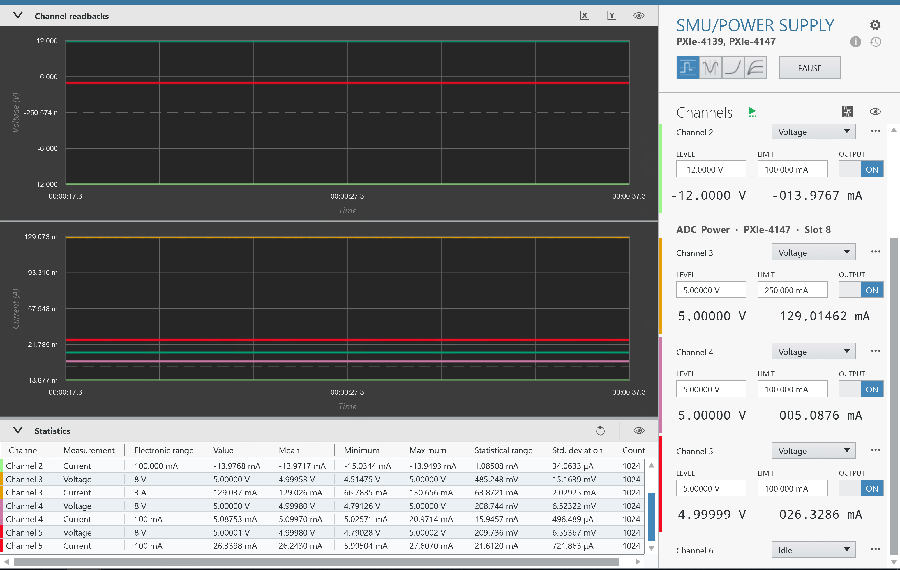
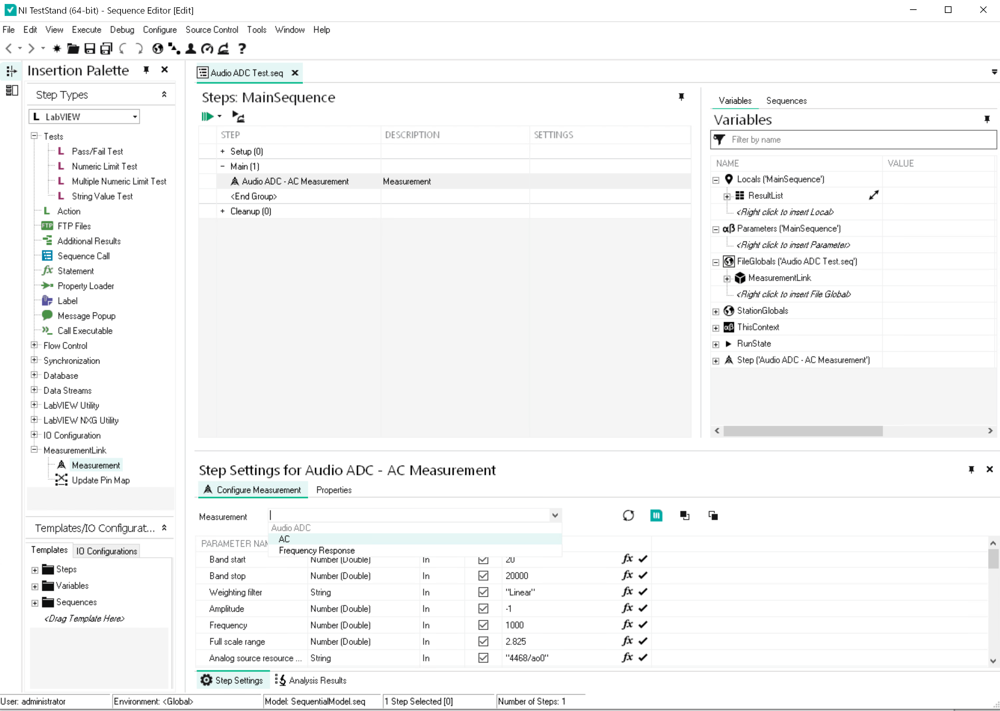
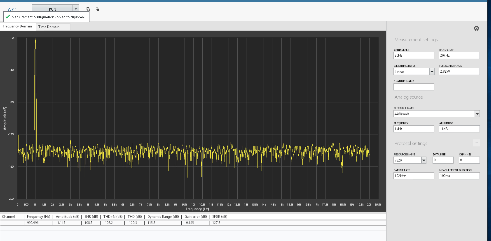
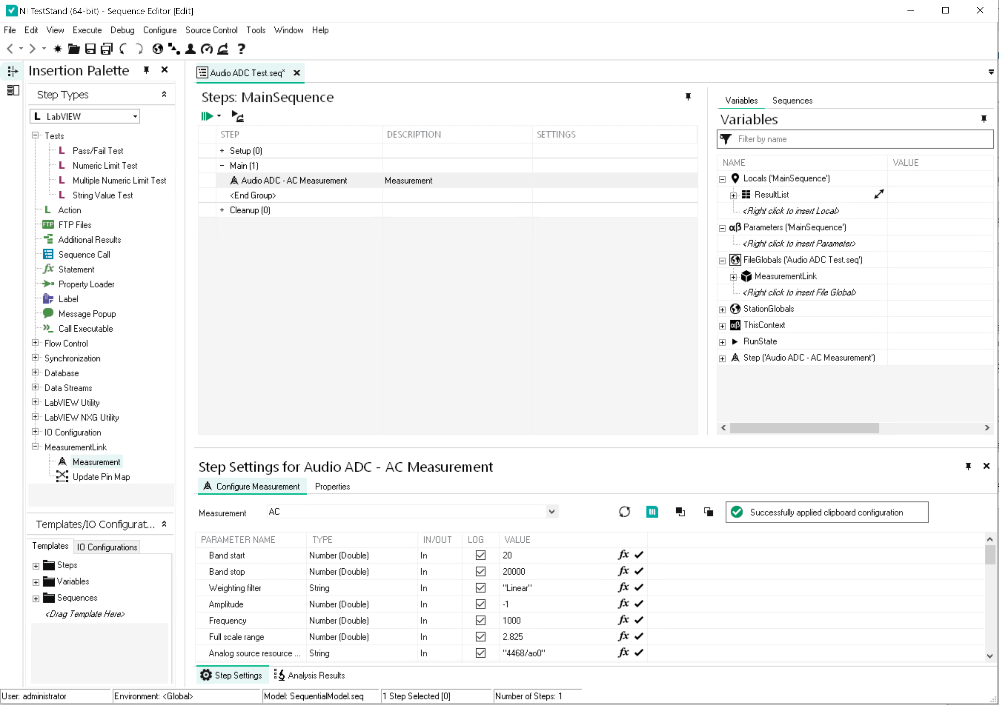
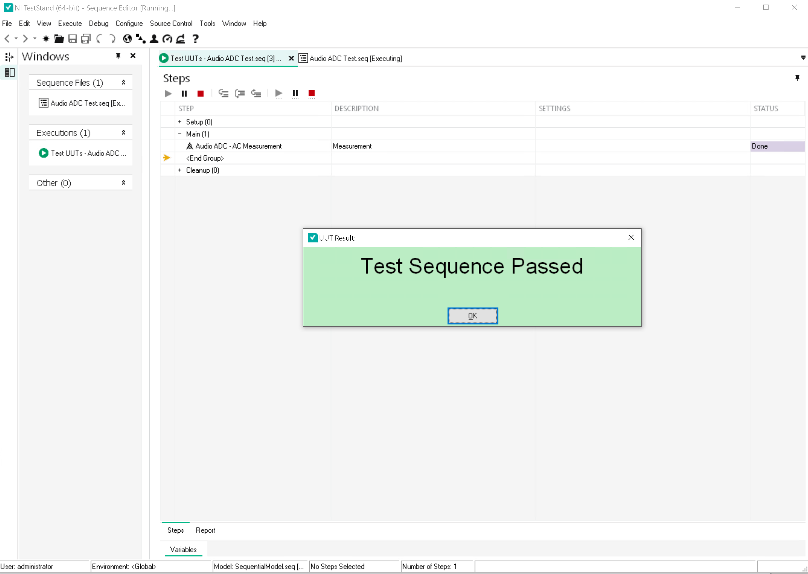
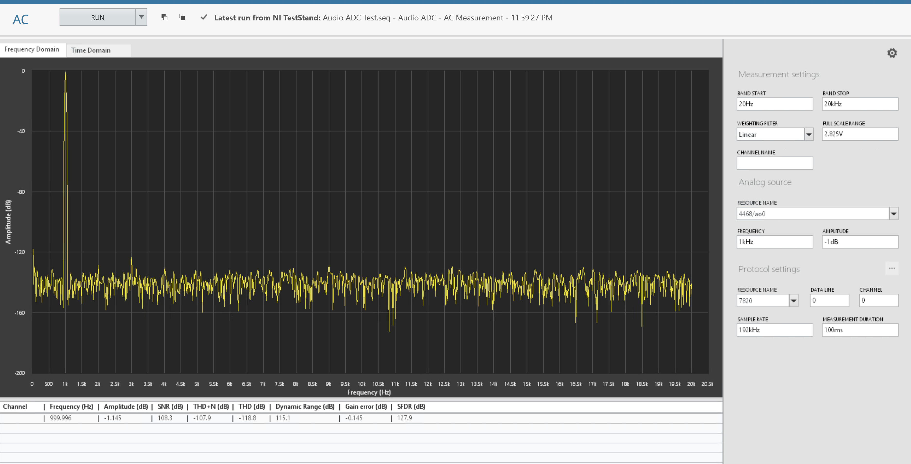

# Getting Started

## Adding a measurement panel to InstrumentStudio

1. Open InstrumentStudio
   

2. Click Manual Layout, and select required measurement under the collection (for e.g., AC under Audio ADC) and 'Create Large Panel' from dropdown. Click OK.
   

3. AC measurement UI will get displayed on a large panel as shown in below screenshot.
   

### Powering ON
Before starting the measurements, ensure the DUT is powered up. In case, SMUs are required to power up the DUT, add separate panel for configuring SMU voltages & other settings.

1. In a new Manual Layout, select required SMUs, Create Large Panel and click OK.

   

2. Set 12V and 5V Supplies according to the actual board connections: 

   Turn on the Output for each SMU and click Run. 
   
   

   

### Protocol configuration

1. In any measurement panel, click on three dots icon beside the Protocol settings header. Dialog box will be launched with I2S as default.
   Select the protocol which is required. It will automatically update the defaults of the settings.

   

2. Update any changes required in the settings of the selected protocol.
   
   

3. Click on close and settings will be updated in measurements.
   
   

## Adding a measurment step to TestStand 

Follow the worflow below to automate the measurements using TestStand and monitor it from Instrument Studio.

After adding measurement service into the Instrument Studio as explained above,

1. Open TestStand 2023 Q3 or higher version. Open a new sequence file and save the file. 

   

2. Insert a 'Measurement' step under MeasurementLink in Insertion palette or by selecting Insert Step > MeasurementLink > Measurement in right click menu.
   Rename the step as required and choose the required measurement in Step settings.

   

3. To transfer the measurement configuration from the Instrument Studio to the TestStand, click on "COPY button" highlighted in the screenshot.

   

4. The below indication confirms the Measurement configuration is copied

   

5. Select the measurement step and click on the paste button as highlighted in the screenshot. There will be a message indicating that the measurement configuration is applied.

   

6. Set 'Enable Monitoring' variable to True as shown in below screenshot. It will help us to monitor the results in Instr Studio.

   

8. Save the Sequence file and RUN the sequence. While running the sequence file in TestStand you can see measurement results and graphs updated in the InstrumentStudio as well.

   

9. The measurement results are updated in the Instrument Studio as below.

   

Please refer [this](measurements\meas-index.md) for more details on each measurement.