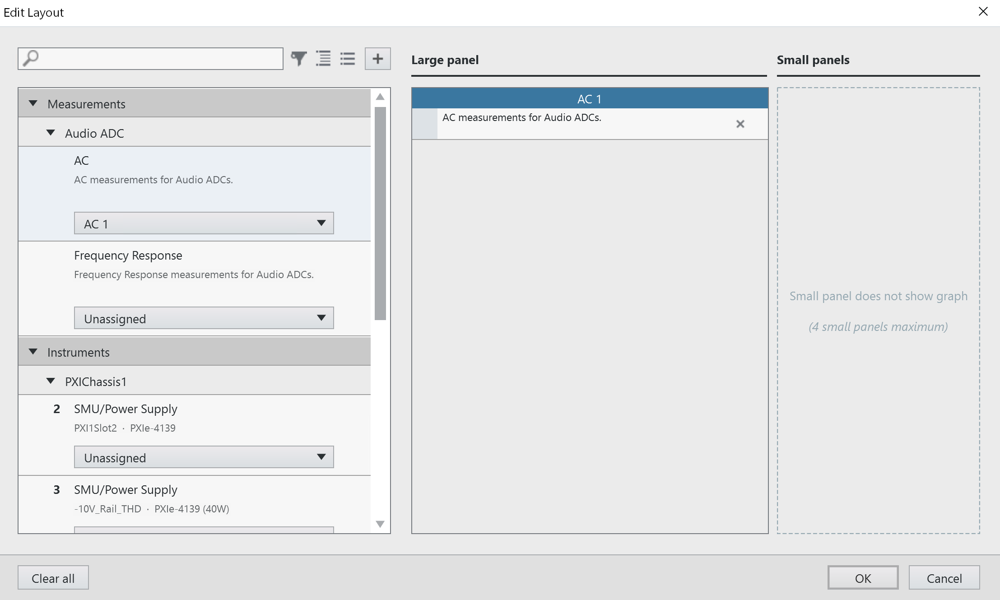
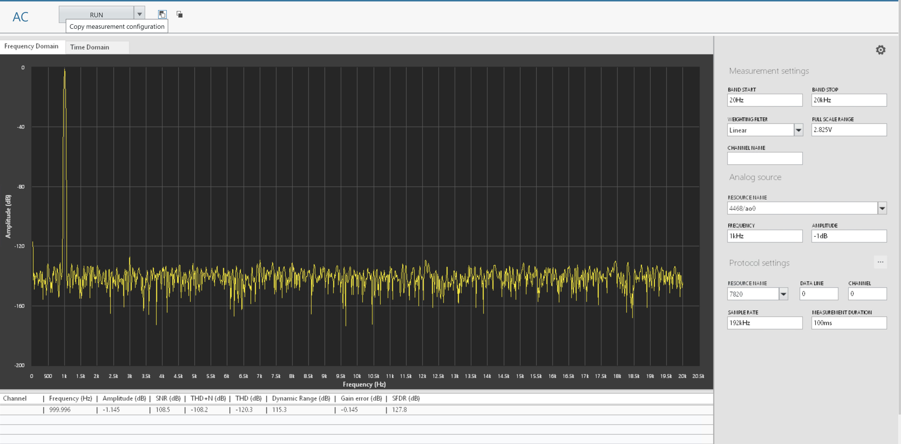

# Getting Started

## Adding a measurement panel to InstrumentStudio

1. Open InstrumentStudio
   

2. Click Manual Layout, and select required measurement (e.g., Audio ADC - AC Measurement) and 'Create Large Panel' from dropdown. Click OK.
   

3. AC measurement UI will get displayed on a large panel as shown in below screenshot.
   

### Powering ON
1. In a new Manual Layout, select required SMUs, Create Large Panel and click OK.

   

2. Set 12V and 5V Supplies according to the actual board connections: 

   Turn on the Output for each SMU and click Run.
   

### Protocol configuration

1. In AC Measurement panel, click on three dots icon beside the Protocol settings header. Dialog box will be launched with I2S as default.
   Select the protocol which is required. It will automatically update the defaults of the settings.

   

2. If there are any changes in the settings of the selected protocol making changes in settings section.
   
   

3. Click on close and settings will be updated in measurements.
   
   

## Adding a measurment step to TestStand 

The following workflow provides an example to show how we can automate our measurements using TestStand from the Instrument Studio and also shows how monitoring can be done. 

After following above steps to add measurement service into the Instrument Studio.

1. Open TestStand 2023 Q3 or higher version. Open new sequence file or saved sequence file. 

   

2. Insert a 'Measurement' step under MeasurementLink in Insertion palette or by selecting Insert Step > MeasurementLink > Measurement in right click menu.

   

3. To transfer the measurement configuration from the Instrument Studio to the TestStand, click on "COPY button" highlighted in the screenshot.

   

4. The below indication confirms the Measurement configuration is copied

   

5. Select the measurement step click on the paste button as highlighted in the screenshot. There will be message indicating that the measurement configuration is applied.

  

6. Save the Sequence file and RUN the sequence. While running the sequence file in TestStand you can see measurement resultant graphs and results  updated in the InstrumentStudio as well.

   

7. The measurement results are updated in the Instrument Studio as below.

   

## Measurements
### AC

1. Select appropriate resource names, data line and channel according to the hardware setup and DUT specs. Ensure the protocol settings are good. Please note that, measurement is working in I2S by default.

   

2. Run the measurement. The frequency, amplitude, SNR, THD, THD+N, Dynamic Range, Gain error, SFDR values are calculated and displayed in the panel below.

   
3. The generated and acquired signals can be seen from time domain and frequency domain graphs.

   AC Measurement - Frequency Domain:
   

   AC Measurement - Time Domain:
   

### Frequency Response

1. Select the appropriate resource names, data line, channel the DUT is connected to and run the measurement service with the default values.
   

2. FR, RMS Levels, THD, THD+N, time domain graphs should be visible without any error.

   Frequency Response:
   

   RMS Levels:
   

   THD:
   

   THD+N:
   

   TimeDomain:
   
