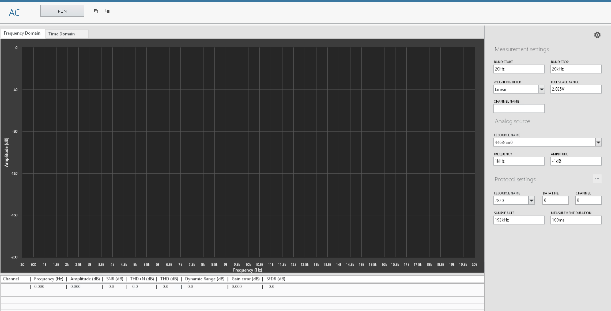
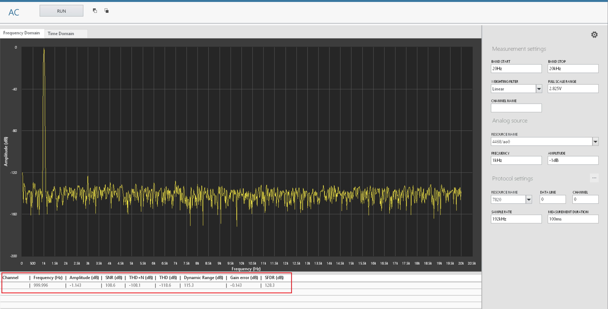
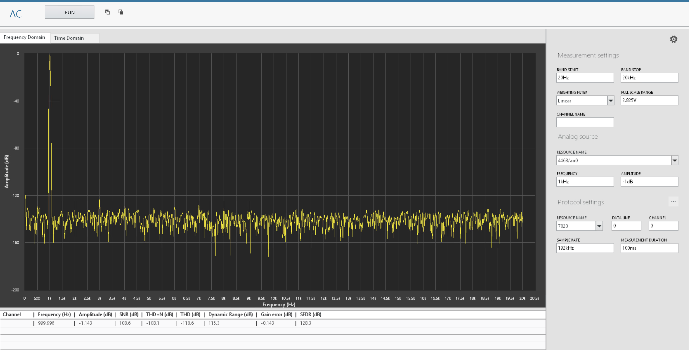
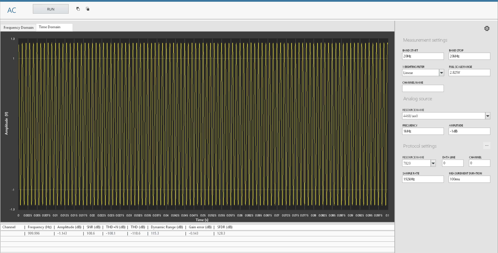

# AC
This service performs AC measurements: SNR, THD, THD+N, SFDR, Dynamic Range, Gain Error.

## Tested Hardware Setup 1

  

## Tested Hardware Setup 2

  

## InstrumentStudio Panel

### Usage

1. Select appropriate resource names, data line and channel according to the hardware setup and update other parameters as needed. Ensure the protocol settings are good. Please note that, measurement is working in I2S by default.

   

2. Run the measurement. The frequency, amplitude, SNR, THD, THD+N, Dynamic Range, Gain error, SFDR values are calculated and displayed in the panel below.

   
3. The generated and acquired signals can be seen from time domain and frequency domain graphs.

   AC Measurement - Frequency Domain:
   

   AC Measurement - Time Domain:
   

