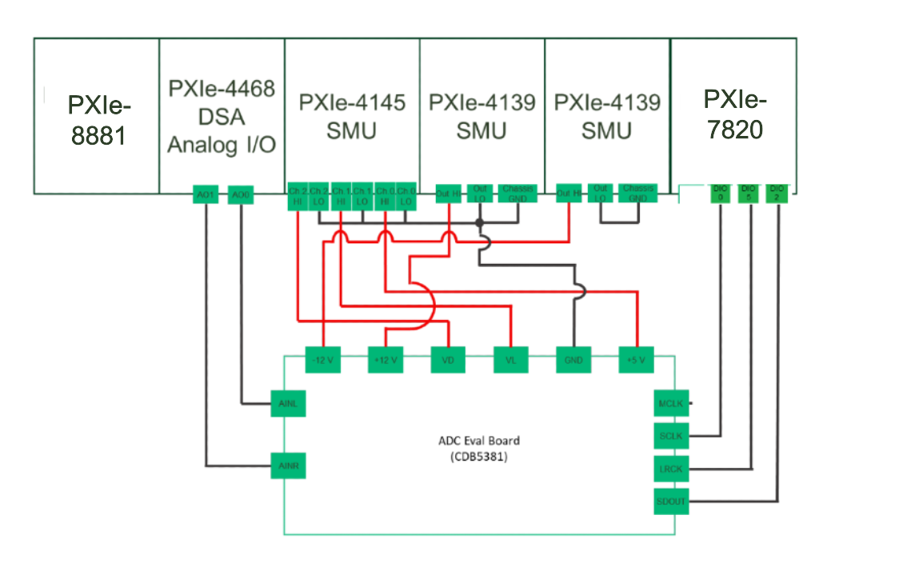
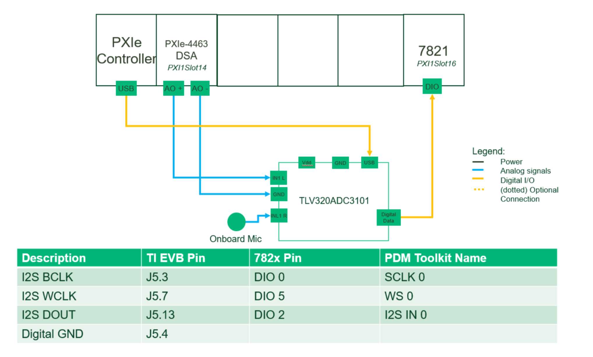
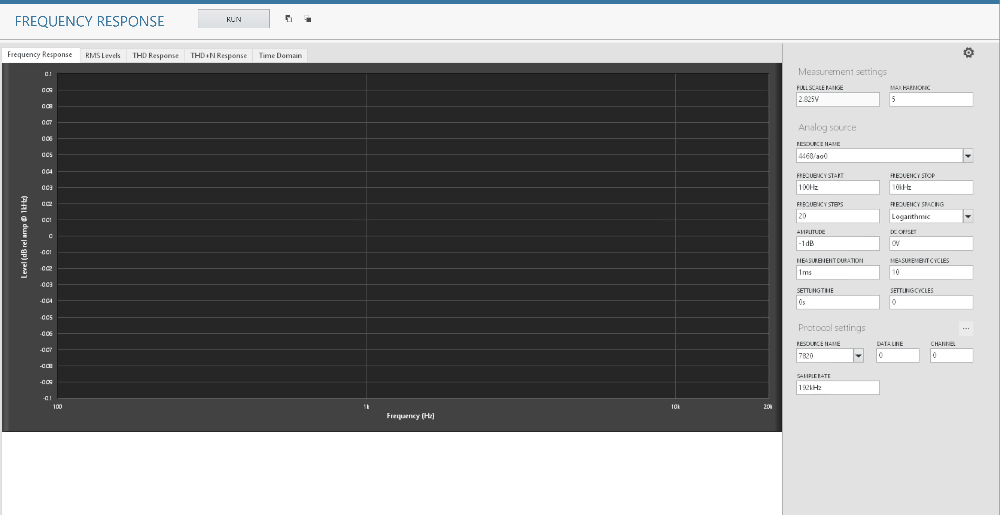
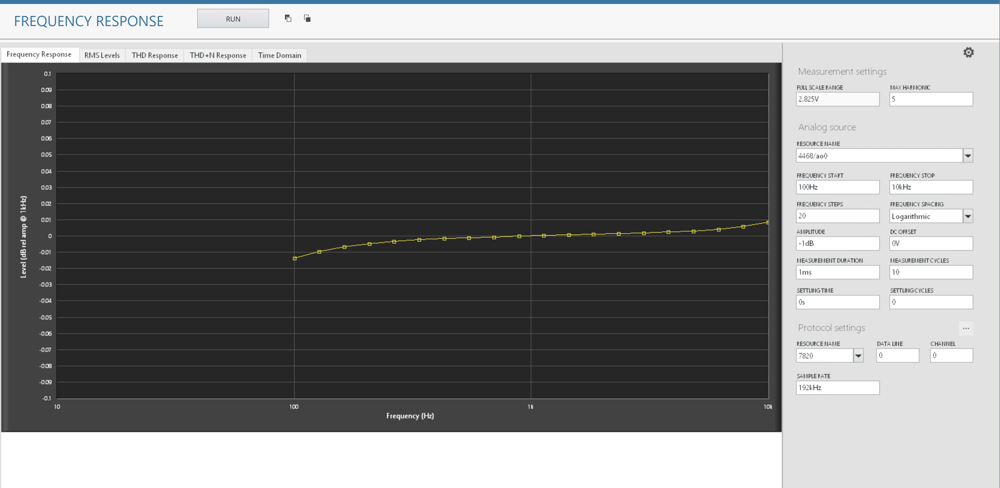
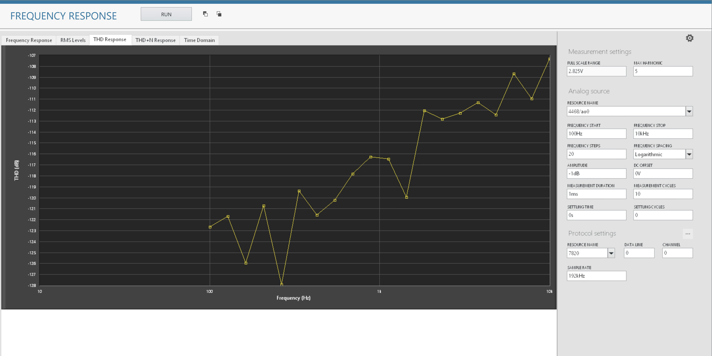
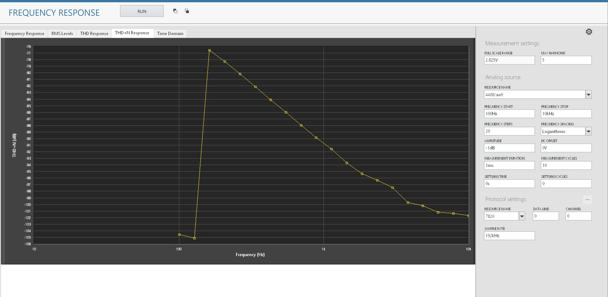
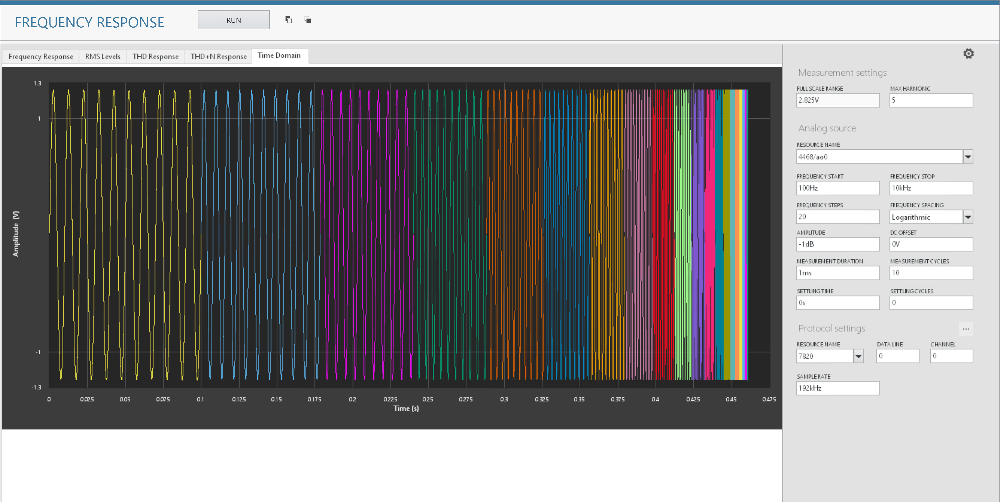

# Frequency Response
This service performs Frequency Response measurements.

## Tested Hardware Setup 1

  

## Tested Hardware Setup 2

  

## InstrumentStudio Panel

### Usage

1. Select the appropriate resource names, data line, channel the DUT is connected to and run the measurement service with the default values.
   

2. FR, RMS Levels, THD, THD+N, time domain graphs should be visible without any error.

   Frequency Response:
   

   RMS Levels:
   

   THD:
   

   THD+N:
   

   TimeDomain:
   

